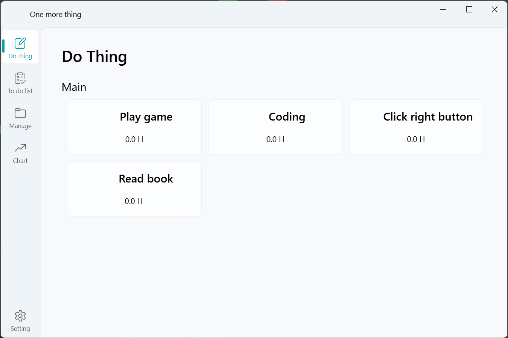
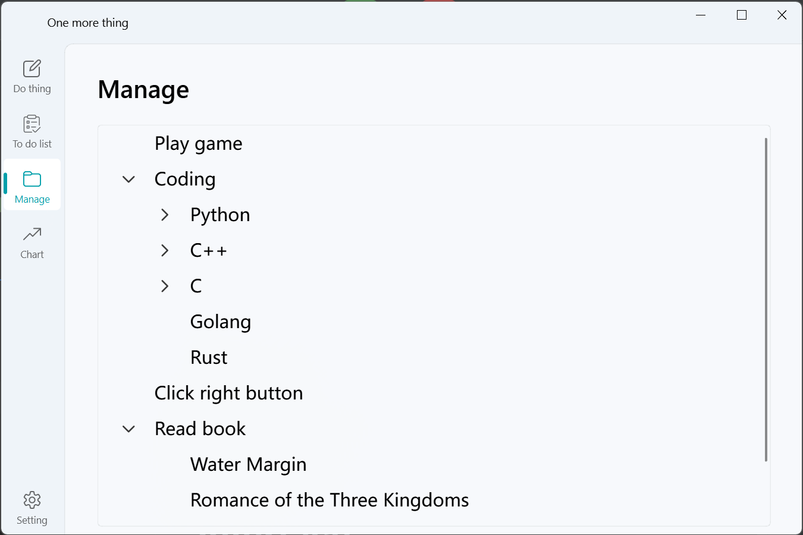
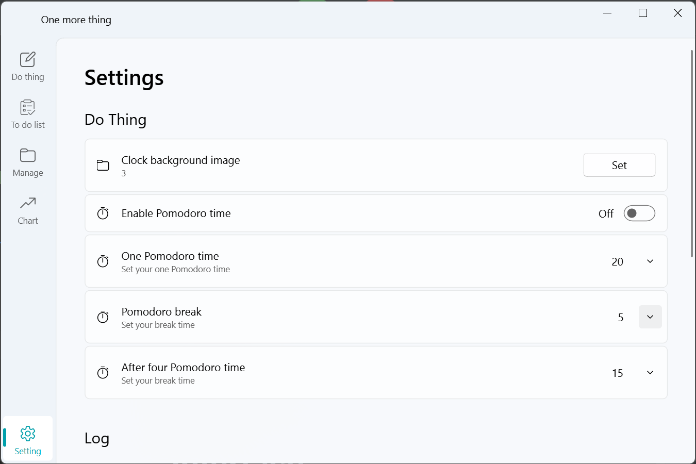

# one-more-thing

## How to use
`Python >= 3.11`
1. Clone the repository
    ```git
    git clone git@github.com:JunNanLYS/one-more-thing.git
    ```
   Run main.py
2. Download the [zip file](https://github.com/JunNanLYS/one-more-thing/releases)

## Interface
### Do thing interface

### To do list interface
unfinished
### Manage interface

### Chart interface
unfinished
### Setting interface


## Features
- [x] Do thing
- [x] Count time
- [] To do list
- [x] Manage
- [] Chart
- [] Pomodoro time
...